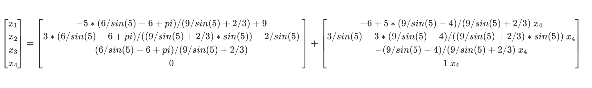

# System of Linear Equations Solver

## Table of contents
* [Introduction](#introduction)
* [Technologies](#technologies)
* [Illustrations](#illustrations)

## Introduction

A web app powered by Flask to calculate the solution of systems of linear equations of dimension NxN with real coefficients. The solver function is an implementaction of the Gauss–Jordan elimination method and the app is deployed on Heroku.

## Technologies
This project was created with:
* Python 3.8.9
* Flask 1.1.2
* Sympy 1.7.1
* HTML
* CSS

## Illustrations

