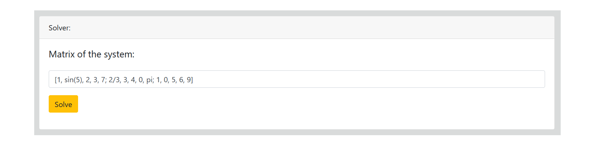

# System of Linear Equations Solver

## Table of contents
* [Introduction](#introduction)
* [Technologies](#technologies)
* [Example](#example)

## Introduction

A web app powered by Flask to calculate the solution of systems of linear equations of dimension NxN with real coefficients. The solver function is an implementaction of the Gauss–Jordan elimination method and the app is deployed on Heroku [lets go to](https://www.quora.com).

## Technologies
This project was created with:
* Python 3.8.9
* Flask 1.1.2
* Sympy 1.7.1
* HTML
* CSS

## Example
For a  following system:

The input of the solver is the extended system coefficient matrix

Then the solution is show as:

